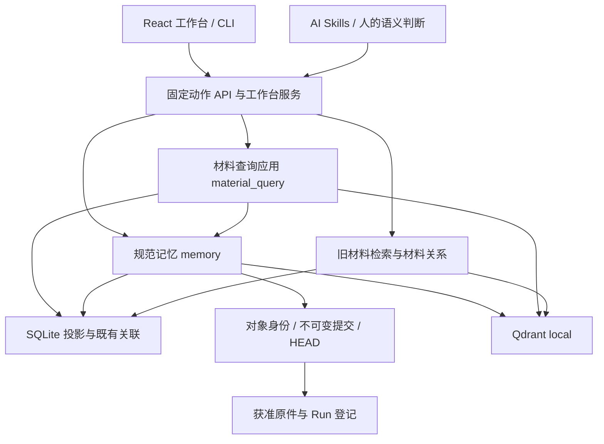

# 当前技术架构

本页只维护现行模块、依赖、状态所有权和仍然有效的架构限制。用户概念与用法见 [README](README.md)，功能输入输出见 [CORE](docs/CORE.md)，细节见[文档索引](docs/README.md)，选择理由和实施历史见[开发决策与演进记录](docs/DEVELOPMENT_HISTORY.md)。历史设计不替代运行代码。

## 稳定设计约束

本节用于约束后续设计，实际依赖和未完成项见下文；原则保留下来不表示代码已完全达到目标。根规则的三项评价标准见 [AGENTS](AGENTS.md)。

| 设计时必须守住的边界 | 对开发方案的要求 |
|---|---|
| 按变化原因划分模块 | 规范存储、检索和 AI 行为控制分别演进；核心定义稳定接口，外围实现接口。不为消除表面重复提前绑定不同概念，也不凭接口名称宣称后端可替换 |
| 状态少、集中、显式 | 每类状态有唯一权威来源和明确转换；保存、索引、复核、关联采纳分别表达。新增状态先说明维护者、生命周期、失败恢复及消费者，不能让 UI 或缓存成为第二份业务真源 |
| 性能收益须有依据 | 新抽象、缓存或图机制须解决已存在或高度确定的问题；用可重复评估比较准确度、召回、错误关联、延迟与上下文成本。输出 Top-K 或短正文不能证明底层读取有界 |
| 对象、内容、文稿分开 | 复用 Research、Run、Project、核心算法、数据、工具、知识和报告的稳定身份，不复制等价 Owner；Project 聚合目标和引用，不另存算法副本。L0 是原件追溯，L1 检索说明与完整块分开，层级不是可信等级，独立章节/文稿不另造记忆层 |
| 权威记录与派生数据分开 | 原件、规范修订和复核记录不能被索引替代。索引可重建；Q/CTX/CF、QMEM/PKT 等已保存回执是查询与选择的历史，不能当作临时索引随意清理；MQ 进程内请求状态另有到期规则 |
| 发现与全文读取分开 | Owner默认发现使用独立压缩投影和独立水位，不能以全文索引的level过滤冒充；命中回到规范固定版本核验。全库全文补偿由用户明确选择，已选Owner的完整阅读仍是标准流程；legacy RS和手动MQ保留全文兼容路径。 |
| 写入和恢复保持单一边界 | 规范写入走 MEM 服务，保留版本冲突、幂等、不可变历史和单 Owner 事务边界；索引失败补偿投影，不重复创建业务记录，不把跨对象部分完成写成全局成功 |
| 语义判断与程序执行分开 | AI/人负责综合、反证、迁移判断和实际审查；程序校验、固定读取、组装及提交。影响提示和监测只产生关注/候选，不自动改章节引用、撤回结论或晋升复核；相似和导航采纳不等于科学支持 |
| 请求边界贯穿全链路 | 查询、续页、展开与组包保留用途、范围、排除、权限、固定版本及适用预算；普通MQ/legacy RS保留累计账本，Owner阅读分开单次资源保护与最终note上下文，来源选择不放宽授权。候选不是已读正文，组包无缺口不代表研究完整 |

修改方案先定位下方模块影响表中的责任模块，再追踪实际调用者和数据消费者；涉及新职责、状态或依赖时，先补清归属、关系与变化原因，再决定是否自动化。契约变化同步检查生成类型、CLI/HTTP/UI、Skill、相关测试及升级兼容；只检查实际受影响路径，不机械全库重测。当前定义与实现差距必须保留，不能借整理文档掩盖它。

## 技术栈与运行入口

Windows x64 本地应用：`workbench.cmd` / `workspace_cli.py` 启动 Python CLI 或本机 HTTP 服务；工作台使用 React/TypeScript，构建后的 JS/CSS/Worker 随源码交付。使用端无需 Node，开发依赖由前端锁文件管理。

原始业务卡使用 JSON/Markdown；规范记忆使用对象内不可变文件提交。SQLite FTS 和 Qdrant local 提供可重建检索投影；本地嵌入/OCR 由匹配的离线依赖包提供。材料查询支持身份、词法与显式启用的本地向量通道；通道实现存在与本机模型/索引就绪分别表达，缺失时保留其他通道并报告降级。

图表示主要调用/读取关系，不表示每次请求都会经过全部节点。权限、证据核验和计量横跨相关路径；AI 不直接写规范存储文件。

## 模块与变化影响

代码路径除显式 `automation/` 外均相对 `automation/scripts/`；同一单元格中省略目录的文件沿用前一文件的目录。下表是全局模块影响的唯一现行入口；Project 只保存本次处置与历史快照。

| 模块 | 实际职责与代码入口 | 变化时检查的关联 |
|---|---|---|
| OBJ 对象与来源 | `manifest_discovery.py`、`run_capture.py`、`memory/owners.py`、`raw_materials.py`（后者在 memory 内）：稳定身份、唯一 Run 归属、L0 追溯 | MEM 身份/兼容、EVD 授权、RET 索引、MQ 原件回读、APP 树、QA 升级保护 |
| MEM 规范版本 | `memory/contracts.py`、`service.py`、`store.py`、`recovery.py`：验证、CAS、幂等和恢复；schema 在 `automation/schemas/` | DOC/EVD/RET/MQ 的全部读取者、生成类型与旧版迁移 |
| DOC 技术内容 | `memory/technical_units.py`、`documents.py`、`history.py`、`research.py`：完整块、可选章节/文稿与续接 | MEM 字段、RET 表示、MQ 组包/定位、EVD 影响检查、APP 与研究 Skill |
| EVD 来源与证据 | `evidence.py`、`memory/evidence_adapter.py`、`impact.py`、`lineage.py`：复核、权限和已登记依赖影响 | 所有正文返回、正式筛选、文稿、关联、监测与导出 |
| RET 投影与基础检索 | `retrieval.py`、`context_engine.py`、`qdrant_backend.py`、`memory/index.py`、`memory/discovery.py`、`search.py`、`packets.py`、`associations.py`；discovery 从L4/L3/L2紧凑内容和L1检索说明构建独立词法/向量投影 | MQ 召回/覆盖、旧 API、来源撤权、模型隔离、相关性和读取成本；discovery不得复用全文表加level过滤 |
| MQ 材料查询应用 | `material_query/`：Coordinator 编排；`recall.py` 适配既有本地向量并核对条目指纹；Reader/Writer 适配；`content.py` 固定关联展开，`catalog_search.py` 全来源召回，`history_search.py` 有界旧修订查询，`documents.py` 文稿去重与有序组装，`native_sources.py` 核验旧 Run claim；StateStore/Ledger 管请求状态和累计预算；Foundation 接旧功能分组 | MEM 事务、RET 水位、DOC 固定块、EVD 准入、APP 生成契约与三个专项 Skill |
| APP 产品入口 | `workspace_cli.py`、`memory/api.py`、`material_query/api.py`、`workbench_app/`、`automation/frontend/src/` | 同一动作的 CLI/HTTP/UI 请求与错误、任务进度、契约、构建资源、操作文档 |
| CFG 工作区默认设置 | `workspace_settings.py` 唯一契约/校验/CAS/缓存；`workspace_settings_cli.py`、APP settings API与设置页是适配层 | MQ capabilities/READ template消费默认策略与联想限制，GUIDE消费协作策略；旧RS预算、用户设置升级保护、UI并发保存与缓存失效 |
| GUIDE 规则与说明 | `automation/workflows/` 方法源、`.agents/skills/` 发现入口及六份必读文档 | 所描述能力的代码/契约、用户入口、测试选择；不复制一套业务状态 |
| READ AI 阅读工作流 | `material_query/reading.py`、`reading_catalog.py`：持久问题会话与有界目录发现；`reading_owner.py`管理 discovery 融合、互补筛选包、三态判断、逐Owner正文/引用按需展开和显式全文补偿，`owner_screening.py` 选择窗口，`reading_strategy.py`管理standard/associative/quick、逐条判断和综合note，旧模式保留；复用 MQ Reader/Assembler/Ledger | MQ 权限/预算与固定回源、CLI/HTTP及ReadingSessions界面、原件新修订、GUIDE 续接策略、QA 用户工作数据升级保留；发现包不是完整正文，CE不删除Owner，全文补偿不能自动触发 |
| QA 测试与交付 | `automation/testing/`、`automation/tests/`、`deployment.py` 及依赖分发 | catalog 与实际回执、前端指纹、旧业务/自定义 Skill 保留、离线包与恢复 |

表中一行变化时检查其实际调用者、数据消费者和对应细节文档；不是要求每次全模块重测。文档路由与维护方式见 [DOCUMENTATION_MAINTENANCE](docs/DOCUMENTATION_MAINTENANCE.md)。

## 状态由谁负责

单条 L0–L4 的上下文独立性由 GUIDE 写作规则和形成记录的 AI 逐条回读负责，MEM 继续只校验结构、固定来源和版本；不新增自动语义通过状态。APP 的常用记录筛选收敛到五层与研究文稿，辅助工作流类型保留原契约。证据详情从同 Owner 已保存的 claim 复核读取确认状态并比较内容绑定，展示元数据不等于重新运行 EVD 的当前证据有效性验证。

| 状态 | 权威来源 | 独立边界 |
|---|---|---|
| 对象、Run、来源授权 | 原生 manifest、`run.json`、`retrieval/sources.json` 及获准原件 | 文件存在不等于登记；登记不保证固定原件仍可读 |
| 规范内容与历史 | Owner 的 `memory_home` 中 owner/commits/HEAD 与事务回执，MemoryStore 管理 | 单 Owner 提交可见；旧修订不改写，没有跨 Owner 全局事务 |
| 保存与索引 | 保存回执；SQLite `memory_*` 表及 FTS/向量水位 | HEAD 发布后索引失败仍是已保存，reconcile 补偿，不重建同一业务记录 |
| Owner压缩发现投影 | RET维护的独立discovery entries/FTS、向量collection及每Owner词法/向量水位 | 从当前规范记录确定性派生，可删重建；水位绑定HEAD、投影版本、模型指纹和错误，pending/stale/failed投影不可读；不替代全文索引、正文、证据或复核。旧Owner语义补写必须先走MEM提交再重建 |
| 查询候选、选择与预算 | MQ 进程内 QueryState、StateStore、Ledger | 默认 900 秒 TTL；游标绑定原请求/会话，重启或到期失效；不是持久知识 |
| 工作区偏好 | 根`workspace-settings.json`，CFG维护，缺文件使用内置默认 | schema1完整快照、内容hash revision、O_EXCL锁与原子替换；最多64根stat签名进程缓存，仅为派生副本。新模板/页面读取，显式请求及已存RS不被改写；公共源码不分发本机配置 |
| 当前任务工作上下文 | 所属任务的一份Markdown计划/清单，由AI编辑 | 综合目标、当前依据、必要细节与下一步；RS与Run通过引用接入。不是后台同步、规范知识或第二份阅读数据库；检查点保存交接时点，续接需核验新进展 |
| 当前问题阅读工作 | `.local/reading-sessions/` 的 HEAD、revision历史与请求/消费记录；Reading 管理 | RS 的处理模式为 `owner_document` 或兼容 `legacy`，阅读策略及联想配置独立冻结；单会话锁和版本比较。quick只保留实际交付片段判断，综合note固定底稿/来源并在变化时失效；旧模式跨进程累计预算，新模式固定阅读数/note限制、逐操作资源账本，均重验授权；不复活MQ游标、不替代规范知识。此目录是用户工作数据，不能按缓存删除 |
| 阅读上下文展示 | 由 RS 渲染的 `context_markdown`；`context/reading-notes/<RS-ID>/current.md` 为可读副本 | 当前JSON 是会话唯一状态源（工程选择，非正文必须用JSON）；多段Markdown正文由同一状态渲染，格式不要求短摘要。Markdown 不回写状态、不加入知识召回/通用全量上下文、不自动晋升结论。带会话/版本及快照限制，源码发行排除，升级保留；显示当前内容仍经授权与来源检查 |
| 查询术语与冻结计划 | `retrieval/query-terms.json` 是用户维护词库；`material_query/query_plan.py`加载校验并构造本轮计划，RS保存该轮指纹及实际展开 | 公共种子单独位于`automation/templates/query-terms.default.json`，仅补缺；阅读计划可含受保护的中英等义变体，续页使用冻结计划，词库修改不回写已发生查询。同义与关联分开；手动查询不自动调用 AI 翻译，也不新增规范知识、模型或后台翻译服务 |
| 语义维护计划 | `.local/material-query/plans/` 不可覆盖计划版本 | 与规范提交分开；重启后用新查询重新授权旧计划，可能逐 Owner 部分完成 |
| 复核与关联采纳 | 原生/记忆 claim、review；association 的采纳状态 | 保存、索引、复核和导航采纳不能合成“成功” |
| 视图和观察 | `.local/workbench/` 视图/候选、`context/monitor/` 观察记录 | 不改规范证据；工作台后台任务状态不代替实际扫描/索引结果 |
| 历史查询及反馈 | 旧 Q/CTX/CF、记忆 QMEM/PKT 及各自回执 | 各自入口使用自己的身份和预算语义，不可互换 |

新 Run 默认属于开展工作的 Owner；无归属轻任务可落根 runs，旧布局兼容。来源搬迁通过显式旧路径/固定 SHA 映射回读，不重写旧 Run。

## 现行数据流与限制

### Owner 发现与全文读取

主数据流为“规范记录 → 独立压缩发现投影 → 路线内 Owner 折叠 → 跨路线融合 → 互补筛选包 → AI 三态判断 → relevant Owner 完整阅读”。发现投影与全文索引分离；发现不可用、覆盖不足或结果不足时只报告缺口，必须由用户明确选择后才进入全文补偿，并继续使用冻结的范围、计划、预算和版本。详细机制见 [Owner 发现设计](docs/design/OWNER_DISCOVERY_RETRIEVAL.md)。

### 阅读模式与上下文

新阅读会话使用[按对象完整阅读处理模式 `owner_document`](docs/AI_READING.md#术语与两个独立维度)，旧会话保持 `legacy` 兼容语义。`standard` 与 `associative` 在筛选后逐 Owner 读取完整文稿；后者只在信息不足时按受限联想文本补查。`quick` 只处理实际交付片段，必须明确不代表全文覆盖。综合 note 固定其底稿和来源，任一变化都会使旧综合稿失效；联想线索不能自动晋升为关联或科学结论。

Owner 模式把单次工程资源保护与最终 note 上下文限制分开；内部诊断不冒充交付内容。图片、L0、Run 和外部依据先保留固定引用，按需展开并重新核验。仅存在原生 `run.json`、没有可检索正文的 Run 不进入分层阅读召回。详细调用与兼容边界见 [AI 阅读手册](docs/AI_READING.md)。

### 工作台与监测

页面结果、选择和草稿只保留在当前浏览器标签页；业务版本仍以服务端规范记录为准。切换 Owner 必须隔离旧异步请求，浏览器刷新不恢复临时状态，也不延长查询游标。证据详情由共享读模型按记录类型装配，结构导航与支持证据分开。

监测只覆盖 Owner 记录和记忆 HEAD；范围外的 Run 发布产物不因引用进入周期哈希。监测用有界观察与正式证据核验分开，未观察文件不能标作匹配，不完整快照不能覆盖旧基线。详细边界见 [证据与监测](docs/EVIDENCE_VIEW_MONITOR.md)。

### 设置与协作

CFG 是工作区默认设置的唯一契约，工作台和 CLI 只是适配层。显式请求和已保存阅读会话不随默认值变化；私人配置不进入公共发行包。子 Agent 能力要求只是原样交给宿主的偏好，`off` 和授权边界始终优先；旧配置缺新增字段时可补默认读取，完整写入仍须保留已有字段。

协作关闭或宿主无相应能力时沿同一会话单 Agent 执行，程序不依赖特定厂商 Agent SDK，也不能计量宿主模型 token。委派只交付有界任务包和 notes-only 回执，不建立第二套任务状态。

### 排序、预算与降级

AI 阅读可在固定正文和必要定义上使用显式条件与离线 Cross-encoder 重排；未知条件不等于冲突，低分候选不被删除。模型不可用、输入不完整、资源不足或单窗过长时，当前窗口显式回退到原排序，不影响其他窗口。Cross-encoder 是 READ 的可选组件，不改变 384 维召回编码，也不代表通用模型提供器已经开放。

身份、词法和向量通道按规范身份去重后融合；查询返回有界不表示底层计算固定。本地向量扫描、SQL 排序、来源闭包和历史查询仍可能随索引增长。预算、取消和模型费用在实际处理边界核对，界面估算不能代替宿主模型的真实上下文或费用。

### 保存、检索与兼容

规范保存经 schema/领域规则校验，以 expected_head/expected_revision 拒绝覆盖新修改，以 request_id 识别重试；单对象锁内准备不可变提交，再发布 HEAD，之后更新投影。文稿固定跨对象引用并复查依据，是显式版本核验，不是全库数据库快照。

成果整理由 AI 工作流显式执行；记录已保存、全文已同步和结论已复核是独立状态。它不增加后台同步状态或跨 Owner 原子发布。

旧材料检索、规范记忆检索与材料查询兼容存在，但使用不同的表、回执和策略。规范正文只有一份；全文、向量、关系检索索引和 Owner 发现投影都可重建，独立关联记录及已保存回执不能作为临时投影清理。投影版本或模型指纹不匹配时，不能仅凭 HEAD 相同宣称覆盖；重建索引不改变规范历史、原件或结论状态。

MQ 分别校验直接候选范围与必要依据读取上限。来源、类型和分层只筛直接候选，不能误拦父材料已声明的必要依据；显式排除始终保留。默认 `current` 查询及缓存回读重新核验当前修订，`allow_stale` 增加有界旧版本扫描，`fixed` 只保持既定引用读取。

文稿按固定身份去重并保留逐块图像编号；图像须经过来源授权、哈希与字节预算核验。查询、组包和维护回读不引入第二套规范存储或跨查询缓存。

依赖尚未完全倒置：MemoryService 与具体索引有互调，Reader/MeteredStore 复用既有存储，Foundation 仍是受限适配层，不能由接口名称推断后端可以任意替换。MQ 没有注册生成式模型、通用分词提供器或自动维护代理；语义判断仍由 AI 或人通过 Skill 和公开入口完成。

层级迁移只由 MEM 单一写入服务执行，仅允许 `event → narrative`、`map → overview` 的显式完整修订，并须固定引用前版；当前身份保持唯一，旧修订不可变。

### 安装与迁移

安装/升级统一 `setup.cmd`，前端资源及指纹配套交付；依赖与模型离线核验后切换，旧环境保留可恢复回执。标准模型迁移仍限约定名称/路径和兼容 384 维。软件、检索质量、性能、实际 AI、人工及第二物理机验收各自记录；历史质量缺口和万条规模暂缓保持显式。
