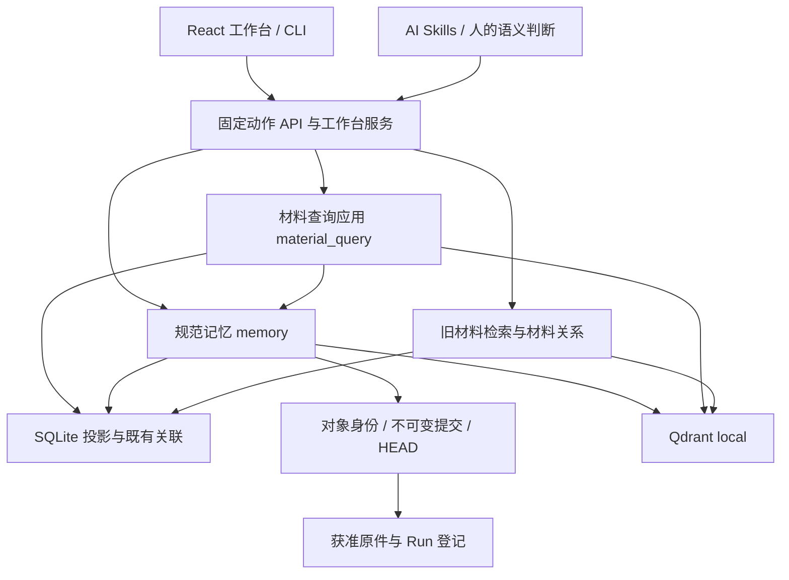

# 当前技术架构

本页维护实际模块、依赖和状态所有权；用户概念与用法见 [README](README.md)，功能输入输出见 [CORE](docs/CORE.md)，细节见[文档索引](docs/README.md)。核对日期：2026-09-18；当前采用统一work-loop与按内容保存策略，阅读会话支持Owner绑定、双语查询规划和用户术语库，重要成果通过consolidate-results维护全文，兼容既有材料查询 v0.2 与固定来源读取。Owner压缩发现投影、Owner融合、筛选包和显式全文补偿已接入；旧 Owner 修复、真实升级恢复及端到端验证仍在收口。历史设计不替代运行代码；具体程序指纹见对应实施 Run。

## 稳定设计约束

本节用于约束后续设计，实际依赖和未完成项见下文；原则保留下来不表示代码已完全达到目标。根规则的三项评价标准见 [AGENTS](AGENTS.md)。

| 设计时必须守住的边界 | 对开发方案的要求 |
|---|---|
| 按变化原因划分模块 | 规范存储、检索和 AI 行为控制分别演进；核心定义稳定接口，外围实现接口。不为消除表面重复提前绑定不同概念，也不凭接口名称宣称后端可替换 |
| 状态少、集中、显式 | 每类状态有唯一权威来源和明确转换；保存、索引、复核、关联采纳分别表达。新增状态先说明维护者、生命周期、失败恢复及消费者，不能让 UI 或缓存成为第二份业务真源 |
| 性能收益须有依据 | 新抽象、缓存或图机制须解决已存在或高度确定的问题；用可重复评估比较准确度、召回、错误关联、延迟与上下文成本。输出 Top-K 或短正文不能证明底层读取有界 |
| 对象、内容、文稿分开 | 复用 Research、Run、Project、核心算法、数据、工具、知识和报告的稳定身份，不复制等价 Owner；Project 聚合目标和引用，不另存算法副本。L0 是原件追溯，L1 检索说明与完整块分开，层级不是可信等级，独立章节/文稿不另造记忆层 |
| 权威记录与派生数据分开 | 原件、规范修订和复核记录不能被索引替代。索引可重建；Q/CTX/CF、QMEM/PKT 等已保存回执是查询与选择的历史，不能当作临时索引随意清理；MQ 进程内请求状态另有到期规则 |
| 发现与全文读取分开 | Owner默认发现使用独立压缩投影和独立水位，不能以全文索引的level过滤冒充；命中回到规范固定版本核验。全库全文补偿由用户明确选择，已选Owner的完整阅读仍是标准流程；legacy RS和手动MQ保留全文兼容路径。 |
| 写入和恢复保持单一边界 | 规范写入走 MEM 服务，保留版本冲突、幂等、不可变历史和单 Owner 事务边界；索引失败补偿投影，不重复创建业务记录，不把跨对象部分完成写成全局成功 |
| 语义判断与程序执行分开 | AI/人负责综合、反证、迁移判断和实际审查；程序校验、固定读取、组装及提交。影响提示和监测只产生关注/候选，不自动改章节引用、撤回结论或晋升复核；相似和导航采纳不等于科学支持 |
| 请求边界贯穿全链路 | 查询、续页、展开与组包保留用途、范围、排除、权限、固定版本及适用预算；普通MQ/legacy RS保留累计账本，Owner阅读分开单次资源保护与最终note上下文，来源选择不放宽授权。候选不是已读正文，组包无缺口不代表研究完整 |

修改方案先定位下方模块影响表中的责任模块，再追踪实际调用者和数据消费者；涉及新职责、状态或依赖时，先补清归属、关系与变化原因，再决定是否自动化。契约变化同步检查生成类型、CLI/HTTP/UI、Skill、相关测试及升级兼容；只检查实际受影响路径，不机械全库重测。当前定义与实现差距必须保留，不能借整理文档掩盖它。

## 技术栈与运行入口

Windows x64 本地应用：`workbench.cmd` / `workspace_cli.py` 启动 Python CLI 或本机 HTTP 服务；工作台使用 React/TypeScript，构建后的 JS/CSS/Worker 随源码交付。使用端无需 Node，开发依赖由前端锁文件管理。

原始业务卡使用 JSON/Markdown；规范记忆使用对象内不可变文件提交。SQLite FTS 和 Qdrant local 提供可重建检索投影；本地嵌入/OCR 由匹配的离线依赖包提供。材料查询支持身份、词法与显式启用的本地向量通道；通道实现存在与本机模型/索引就绪分别表达，缺失时保留其他通道并报告降级。

图表示主要调用/读取关系，不表示每次请求都会经过全部节点。权限、证据核验和计量横跨相关路径；AI 不直接写规范存储文件。

## 模块与变化影响

代码路径除显式 `automation/` 外均相对 `automation/scripts/`；同一单元格中省略目录的文件沿用前一文件的目录。下表是全局模块影响的唯一现行入口；Project 只保存本次处置与历史快照。

| 模块 | 实际职责与代码入口 | 变化时检查的关联 |
|---|---|---|
| OBJ 对象与来源 | `manifest_discovery.py`、`run_capture.py`、`memory/owners.py`、`raw_materials.py`（后者在 memory 内）：稳定身份、唯一 Run 归属、L0 追溯 | MEM 身份/兼容、EVD 授权、RET 索引、MQ 原件回读、APP 树、QA 升级保护 |
| MEM 规范版本 | `memory/contracts.py`、`service.py`、`store.py`、`recovery.py`：验证、CAS、幂等和恢复；schema 在 `automation/schemas/` | DOC/EVD/RET/MQ 的全部读取者、生成类型与旧版迁移 |
| DOC 技术内容 | `memory/technical_units.py`、`documents.py`、`history.py`、`research.py`：完整块、可选章节/文稿与续接 | MEM 字段、RET 表示、MQ 组包/定位、EVD 影响检查、APP 与研究 Skill |
| EVD 来源与证据 | `evidence.py`、`memory/evidence_adapter.py`、`impact.py`、`lineage.py`：复核、权限和已登记依赖影响 | 所有正文返回、正式筛选、文稿、关联、监测与导出 |
| RET 投影与基础检索 | `retrieval.py`、`context_engine.py`、`qdrant_backend.py`、`memory/index.py`、`memory/discovery.py`、`search.py`、`packets.py`、`associations.py`；discovery 从L4/L3/L2紧凑内容和L1检索说明构建独立词法/向量投影 | MQ 召回/覆盖、旧 API、来源撤权、模型隔离、相关性和读取成本；discovery不得复用全文表加level过滤 |
| MQ 材料查询应用 | `material_query/`：Coordinator 编排；`recall.py` 适配既有本地向量并核对条目指纹；Reader/Writer 适配；`content.py` 固定关联展开，`catalog_search.py` 全来源召回，`history_search.py` 有界旧修订查询，`documents.py` 文稿去重与有序组装，`native_sources.py` 核验旧 Run claim；StateStore/Ledger 管请求状态和累计预算；Foundation 接旧功能分组 | MEM 事务、RET 水位、DOC 固定块、EVD 准入、APP 生成契约与三个专项 Skill |
| APP 产品入口 | `workspace_cli.py`、`memory/api.py`、`material_query/api.py`、`workbench_app/`、`automation/frontend/src/` | 同一动作的 CLI/HTTP/UI 请求与错误、任务进度、契约、构建资源、操作文档 |
| CFG 工作区默认设置 | `workspace_settings.py` 唯一契约/校验/CAS/缓存；`workspace_settings_cli.py`、APP settings API与设置页是适配层 | MQ capabilities/READ template消费默认策略与联想限制，GUIDE消费协作策略；旧RS预算、用户设置升级保护、UI并发保存与缓存失效 |
| GUIDE 规则与说明 | `automation/workflows/` 方法源、`.agents/skills/` 发现入口及六份必读文档 | 所描述能力的代码/契约、用户入口、测试选择；不复制一套业务状态 |
| READ AI 阅读工作流 | `material_query/reading.py`、`reading_catalog.py`：持久问题会话与有界目录发现；`reading_owner.py`管理 discovery 融合、互补筛选包、三态判断、逐Owner正文/引用按需展开和显式全文补偿，`owner_screening.py` 选择窗口，`reading_strategy.py`管理standard/associative/quick、逐条判断和综合note，旧模式保留；复用 MQ Reader/Assembler/Ledger | MQ 权限/预算与固定回源、CLI/HTTP及ReadingSessions界面、原件新修订、GUIDE 续接策略、QA 用户工作数据升级保留；发现包不是完整正文，CE不删除Owner，全文补偿不能自动触发 |
| QA 测试与交付 | `automation/testing/`、`automation/tests/`、`deployment.py` 及依赖分发 | catalog 与实际回执、前端指纹、旧业务/自定义 Skill 保留、离线包与恢复 |

表中一行变化时检查其实际调用者、数据消费者和对应细节文档；不是要求每次全模块重测。文档路由与维护方式见 [DOCUMENTATION_MAINTENANCE](docs/DOCUMENTATION_MAINTENANCE.md)。

## 状态由谁负责

单条 L0–L4 的上下文独立性由 GUIDE 写作规则和形成记录的 AI 逐条回读负责，MEM 继续只校验结构、固定来源和版本；不新增自动语义通过状态。APP 的常用记录筛选收敛到五层与研究文稿，辅助工作流类型保留原契约。证据详情从同 Owner 已保存的 claim 复核读取确认状态并比较内容绑定，展示元数据不等于重新运行 EVD 的当前证据有效性验证。

| 状态 | 权威来源 | 独立边界 |
|---|---|---|
| 对象、Run、来源授权 | 原生 manifest、`run.json`、`retrieval/sources.json` 及获准原件 | 文件存在不等于登记；登记不保证固定原件仍可读 |
| 规范内容与历史 | Owner 的 `memory_home` 中 owner/commits/HEAD 与事务回执，MemoryStore 管理 | 单 Owner 提交可见；旧修订不改写，没有跨 Owner 全局事务 |
| 保存与索引 | 保存回执；SQLite `memory_*` 表及 FTS/向量水位 | HEAD 发布后索引失败仍是已保存，reconcile 补偿，不重建同一业务记录 |
| Owner压缩发现投影 | RET维护的独立discovery entries/FTS、向量collection及每Owner词法/向量水位 | 从当前规范记录确定性派生，可删重建；水位绑定HEAD、投影版本、模型指纹和错误，pending/stale/failed投影不可读；不替代全文索引、正文、证据或复核。旧Owner语义补写必须先走MEM提交再重建 |
| 查询候选、选择与预算 | MQ 进程内 QueryState、StateStore、Ledger | 默认 900 秒 TTL；游标绑定原请求/会话，重启或到期失效；不是持久知识 |
| 工作区偏好 | 根`workspace-settings.json`，CFG维护，缺文件使用内置默认 | schema1完整快照、内容hash revision、O_EXCL锁与原子替换；最多64根stat签名进程缓存，仅为派生副本。新模板/页面读取，显式请求及已存RS不被改写；公共源码不分发本机配置 |
| 当前任务工作上下文 | 所属任务的一份Markdown计划/清单，由AI编辑 | 综合目标、当前依据、必要细节与下一步；RS与Run通过引用接入。不是后台同步、规范知识或第二份阅读数据库；检查点保存交接时点，续接需核验新进展 |
| 当前问题阅读工作 | `.local/reading-sessions/` 的 HEAD、revision历史与请求/消费记录；Reading 管理 | RS存储mode为owner_document，strategy/association/association_text独立冻结；单会话锁和版本比较。quick只保留实际交付片段判断，综合note固定底稿/来源并在变化时失效；旧模式跨进程累计预算，新Owner模式固定阅读数/note限制、逐操作资源账本，均重验授权；不复活MQ游标、不替代规范知识。此目录是用户工作数据，不能按缓存删除 |
| 阅读上下文展示 | 由 RS 渲染的 `context_markdown`；`context/reading-notes/<RS-ID>/current.md` 为可读副本 | 当前JSON 是会话唯一状态源（工程选择，非正文必须用JSON）；多段Markdown正文由同一状态渲染，格式不要求短摘要。Markdown 不回写状态、不加入知识召回/通用全量上下文、不自动晋升结论。带会话/版本及快照限制，源码发行排除，升级保留；显示当前内容仍经授权与来源检查 |
| 查询术语与冻结计划 | `retrieval/query-terms.json` 是用户维护词库；`material_query/query_plan.py`加载校验并构造本轮计划，RS保存该轮指纹及实际展开 | 公共种子单独位于`automation/templates/query-terms.default.json`，仅补缺；续页使用冻结计划，词库修改不回写已发生查询。同义与关联分开，不新增规范知识/模型/后台翻译服务 |
| 语义维护计划 | `.local/material-query/plans/` 不可覆盖计划版本 | 与规范提交分开；重启后用新查询重新授权旧计划，可能逐 Owner 部分完成 |
| 复核与关联采纳 | 原生/记忆 claim、review；association 的采纳状态 | 保存、索引、复核和导航采纳不能合成“成功” |
| 视图和观察 | `.local/workbench/` 视图/候选、`context/monitor/` 观察记录 | 不改规范证据；工作台后台任务状态不代替实际扫描/索引结果 |
| 历史查询及反馈 | 旧 Q/CTX/CF、记忆 QMEM/PKT 及各自回执 | 各自入口使用自己的身份和预算语义，不可互换 |

新 Run 默认属于开展工作的 Owner；无归属轻任务可落根 runs，旧布局兼容。来源搬迁通过显式旧路径/固定 SHA 映射回读，不重写旧 Run。

## 数据流与当前限制

当前数据流为“规范记录 → 独立压缩发现投影 → 路线内Owner折叠 → 跨路线Owner融合 → 覆盖互补筛选包 → AI批量三态判断 → relevant Owner完整阅读”。发现不可用、覆盖不完整或结果不足只返回对应缺口和用户可选的全文补偿动作；补偿复用冻结的范围、计划、预算和版本。CE 对单个窗口执行，超长项局部命中中心截窗，失败窗口不取消其他窗口排序。实现集中在 `memory/discovery.py`、`material_query/recall.py`、`query_plan.py`、`owner_screening.py`、`reranking.py` 与 `reading_owner.py`；发现 SQLite 表和向量 collection 与全文索引分离。真实升级/恢复、HTTP/socket 链路和既有长期 Owner 重建已经验证，结果见[实施 Run](projects/architecture-evolution/runs/run-20260917t181639z-af7701fd84ad/RESULTS.md)。详细设计见 [Owner发现设计](docs/design/OWNER_DISCOVERY_RETRIEVAL.md)，实施计划见[架构演进计划](projects/architecture-evolution/plans/owner-discovery-retrieval-20260918.md)。本轮未评价召回质量或性能，不能据功能回归宣称这些收益。

当前阅读选择与模式控制集中在首页 CurrentReading；旧 ReadingSessions 组件不再作为系统记忆入口，历史 RS 的公开接口与存储保留。EVD 的共享读模型按记录种类装配知识正文，文稿沿固定章节/技术块展开；结构导航与支持证据分开，图片只在选中详情中受控读取。工具注册表身份从对应成员解析，索引诊断不挂到无关健康详情。APP 消费同一证据详情，避免在记忆、阅读与证据页面分别拼接原始字段。

2026-09-17 READ新增Owner文稿模式：新模板显式选择owner_document，旧RS缺字段仍按legacy执行。内部复用多路召回、固定回源与重排，交付边界按正文块去重，只向reader返回正文和owner_id；选中Owner后抑制其余片段。一次读取该Owner最新的完整过程文稿，缺失才明确回退报告或真实正文。图片、L0/Run及外部依据保留固定引用并按需展开，不把来源核验等同于实际阅读。研究式note在同RS保存，主Agent仅收note；进度支持续接，宿主自动压缩不由项目控制。

Owner模式把单次工程Ledger与最终note上下文分开，内部搜索/诊断文字不扣最终note额度；阅读数与保守token估算上限由CFG模板固定。旧MQ/legacy RS仍用原累计账本。token估算是可审计代理而非外部模型精确token，必要公式/条件不被程序截断。Run原生conclusion/limitations已存在，但只有原生run.json、没有可检索MEM正文的Run尚不进入三层阅读召回；本轮不新增全库Run扫描或自动总结服务。

2026-09-17 READ新增三种阅读策略：standard维持相关Owner完整文稿阅读；associative仅在不足时，以实际联想文本进行受enabled/max_rounds约束的追加召回，再走相同全文阅读；quick只交付实际召回片段，逐条assessment后写明非全文的note。reading-configure用CAS保存会话模式/方向而不启动搜索、reader或后台AI；reading-synthesize固定Owner note底稿及实际来源，底稿或来源变化后不将旧综合稿交接为当前理解。exploration_clues只保存依据、条件、未知和下一步，不能自动成为关联或科学结论。

2026-09-17 READ新增Owner文稿模式：新模板显式选择owner_document，旧RS缺字段仍按legacy执行。内部复用多路召回、固定回源与重排，交付边界按正文块去重，只向reader返回正文和owner_id；选中Owner后抑制其余片段。一次读取该Owner最新的完整过程文稿，缺失才明确回退报告或真实正文。图片、L0/Run及外部依据保留固定引用并按需展开，不把来源核验等同于实际阅读。研究式note在同RS保存，主Agent仅收note；进度支持续接，宿主自动压缩不由项目控制。

Owner模式把单次工程Ledger与最终note上下文分开，内部搜索/诊断文字不扣最终note额度；阅读数与保守token估算上限由CFG模板固定。旧MQ/legacy RS仍用原累计账本。token估算是可审计代理而非外部模型精确token，必要公式/条件不被程序截断。Run原生conclusion/limitations已存在，但只有原生run.json、没有可检索MEM正文的Run尚不进入三层阅读召回；本轮不新增全库Run扫描或自动总结服务。

APP 页面状态在当前浏览标签页内保留：顶层功能和记忆子功能首次访问后保持组件，切换只改变可见性；业务版本仍由服务端规范记录负责。对象记忆由显式生成触发，研究经过默认优先；切换 Owner 必须隔离旧异步请求，不能显示为新对象结果。浏览器刷新不恢复临时状态，MQ 游标仍遵循原到期和授权边界。

EVD 监测收紧为 Owner 记录和记忆 HEAD，范围外的 Run 发布产物不因引用而进入周期哈希。监测用有界核验与正式证据核验分开；未观察文件不得标作指纹匹配。文件失败可作为页面诊断返回有效记录，但不完整监测快照不得覆盖旧基线。详细扫描范围见 EVIDENCE_VIEW_MONITOR。

APP 页面状态在当前浏览标签页内保留：顶层功能和记忆子功能首次访问后保持组件，切换只改变可见性；业务版本仍由服务端规范记录负责。对象记忆由显式生成触发，研究经过默认优先；切换 Owner 必须隔离旧异步请求，不能显示为新对象结果。浏览器刷新不恢复临时状态，MQ 游标仍遵循原到期和授权边界。

EVD 监测收紧为 Owner 记录和记忆 HEAD，范围外的 Run 发布产物不因引用而进入周期哈希。监测用有界核验与正式证据核验分开；未观察文件不得标作指纹匹配。文件失败可作为页面诊断返回有效记录，但不完整监测快照不得覆盖旧基线。详细扫描范围见 EVIDENCE_VIEW_MONITOR。

READ的`reading_delegation.py`提供宿主无关的委派任务包和notes-only交接。主Agent选择/创建RS并制定联想问题与关键词 → delegate从CFG读取开关并生成最小任务 → 宿主实际启动独立低成本reader → reader按给定范围执行查询/完整读/材料笔记 → 主Agent通过handoff接收单份有界Markdown与状态。note正文不拼会话问题或decision编排；材料建议、限制和证据保留，任务状态及交付缺口分别返回。delegate不执行AI，off/无宿主能力沿同RS单Agent；无新任务数据库或依赖。handoff共用来源再授权与固定revision；旧模式沿原Ledger，新Owner模式独立约束最终note，不累计内部诊断字符；整note装包，过期或超限公开缺口。它不向主侧返回候选正文及整轮诊断；旧view/resume供显式完整检查。宿主AI token无法被本地Ledger观测，必须另控成本。

CFG同时传递子Agent能力要求字符串，供宿主按可用模型选择；默认低成本/较低能力/低推理，自定义文本不改变off或授权。程序不以AI解析配置、不硬绑定厂商SDK。schema1旧磁盘文件仅缺该新增字段时内存补默认，原字节/hash不变；写入仍要求完整新快照，避免旧客户端丢失自定义偏好。缓存机制不变，源码内置默认随发行，私人覆盖值不分发。

设置读取不调用AI或模型：工作台/CLI→CFG→新材料查询capabilities及阅读模板；AI仅在任务入口取精简协作策略。off要求工作区工作流不委派，auto缺宿主能力则单Agent；程序无子Agent执行依赖，也不能强制任意外部宿主工具遵循策略。常驻进程缓存按文件mtime/ctime/size/ino/dev失效，每次仍做路径/stat检查；独立CLI进程首次仍读取小文件。它减少重复解析，不改变查询算法、模型冷启动或索引复杂度。界面显示预算不等于宿主AI上下文窗口。旧search/CTX入口保留原参数。

2026-09-16 READ新增有界正文重排：`reranking.py`管理固定输入、原/新名次、批次费用与降级；`conditions.py`只核对显式字段和值，缺信息/复杂语义为unknown；`cross_encoder.py`是离线ONNX配对评分的外围适配器，manifest与文件状态绑定进程内模型缓存。reading先保留各层RRF候选，Assembler固定回读命中块及requires定义，再在候选窗内以明确条件冲突分组、CE评分排序，最终交付复用已准备的包。新模板auto，旧RS缺字段保持off；不改变旧memory/手动MQ入口。策略与模型身份写入原RS轮次，分页冻结，未评分/低分候选不删除。旧记录模式内部准备消费原读取/输出预算；新Owner模式内部文本不计AI输出，实际返回才计输出，工程IO/模型保护仍存在；模型按实际批次计调用、配对token与rerank_items，取消检查在每批后执行。

标准CE模型作为独立可选离线依赖组件交付，复用onnxruntime/tokenizers/numpy，不改变384维召回编码或触发向量重建。无模型/超长/缺完整输入/CE模型费用预检查不足/模型错误可显式回退，保留条件冲突分组及组内原RRF；required不可用明确失败。旧记录模式正文准备或诊断输出预算耗尽仍停止；新Owner模式诊断留内部，单次资源不足仍公开缺口。标准模型问题、正文及特殊token合计512 token。单个过长候选使本窗CE回退是当前保守边界，不宣称已解决任意长文档重排。自动条件核对仅识别明确字段，不是通用语义或工程有效性验证；相关接口、失败与成本见AI_READING。通用Foundation模型注册仍未开放，此提供器只用于READ。

2026-09-16新增 GUIDE 方法 consolidate-results：work-loop 可自主保存中间记录，在重要成果保存、阶段总结/交接或实质变化时触发完整阅读与同步。复用 DOC 的文稿/章节固定编排和 impact/outline/section-context、MEM 的版本提交；AI 另盘点未引用变化，维护概览与文稿各自关系，全文回读并检查上下文。同步说明仅保存在本任务已有清单/摘要，绑定实际范围与版本，不增加后台代理、数据库、契约状态或跨 Owner 原子发布。“记录已保存”“全文已同步”“结论已复核”独立；普通 commit 不保证已同步。

2026-09-13 AI阅读工作流按L4/L3、L2、L1独立identity/lexical/dense召回，共用持久账本。短候选全文、技术命中块加必要定义；保留后完整交付，再保存AI理解/连接/细节。RS的HEAD是阅读状态唯一真源，显式绑定Owner及可选固定检查点；目录窗口list不建平行索引，view复核来源并返回最新版本。工作台系统记忆可按Owner查看、打开固定原文和导出版本快照。是否补查/询问由AI判断；历史ask_user仍须真实意见，硬范围/预算不变。无后台AI。

2026-09-15阅读召回增加调用者生成的少量中英计划：AI选择语料语言、技术问题英文补查、等义句及领域；query_plan校验保护文本、有界加载词库，同义扩词与单跳关联分别执行。reading按层执行原身份路、各变体词法/dense与低权重关联路，按固定身份融合排名并保存hit/query来源；条件核对仍由AI实际读正文完成。通用QueryRequest及手动工作台查询契约不改；CLI/HTTP阅读入口共用同一执行。新增路数计工程消耗，Owner模式不将内部重复文字算作AI上下文；旧请求累计Ledger兼容且缺库可见；新旧RS续页各沿其已保存计划语义。修改时检查READ/MQ、Skill、术语模板与升级保护、召回预算及相关性。

规范保存经 schema/领域规则校验，以 expected_head/expected_revision 拒绝覆盖新修改，以 request_id 识别重试；单对象锁内准备不可变提交，再发布 HEAD，之后更新投影。文稿固定跨对象引用并复查依据，是显式版本核验，不是全库数据库快照。

旧 `search-knowledge/retrieve-context` 与 `memory search/context` 并存，共用 SQLite 文件但分表、回执和策略。memory 普通知识检索除说明/知识字段外，为 L1 稳定正文块建立派生条目；候选预览仍用检索说明。材料查询复用这些投影，正文命中绑定记录修订与块定位；规范正文仍只有原记录一份，文稿与 L0 保留各自入口。

词法与向量窗口先按记录去重，再限制候选数量，每记录最多保留四条实际命中诊断；RRF 每通道每规范身份只投一票。向量查询输入由本机模型 tokenizer 计量，最多512 token，计入同一查询的模型调用和输入预算。当前本地向量计算仍扫描获准点，SQL排序与身份元数据也可能随索引增大；有界返回不是固定计算成本。推理无法在单次调用中强制中断，完成后立即核对取消/时间预算。

投影和编码版本分别升级到 technical-blocks v4；旧水位即使 HEAD 相同也不算覆盖。重建只更新派生 FTS/向量，不改变规范历史、原件或结论状态；模型文件、384维契约及依赖锁未变。通用 Foundation 模型策略仍未注册，内置 dense 不代表任意模型接口已开放。

MQ 的直接候选范围与必要依据读取上限分别校验。APP 默认把获准全局范围作为依赖上限，保留所有排除；用户可收紧为所选范围。来源、类型和分层只筛直接候选，不能误拦父材料已声明的必要依据。默认 current 查询及缓存回读重新核验当前修订；显式 allow_stale 查询增加有界旧版本扫描，fixed 只保持既定引用读取。维护提交后的历史状态审计按固定依据回读，重新应用仍核验当前 HEAD。文稿在同一查询账本内按固定文稿身份去重，保留逐块图像编号；图像经过 Reader 的来源授权、哈希与字节预算核验。增加这些功能未引入新的数据库、模型、后台任务或跨查询缓存。

依赖尚未完全倒置：MemoryService 与具体索引有互调，Reader/MeteredStore 复用既有存储，Foundation 是受限适配层。不能由接口名字推断后端可以任意替换；部分枚举、来源闭包和历史查询仍可能扫描较大范围，最终 Top-K 不等于固定底层成本。

默认 memory context、评估用完整图扩展、材料图展示和 MQ 的有界加深分别存在。当前 MQ 没有注册生成式模型/分词提供器或自动维护代理；实际 AI/人的语义工作由 Skill 和公开入口完成。主入口以 content_source 在 LIMIT 前限定内容种类，读取已有完整正文；expand 在原 QueryState/Ledger 内按固定关联展开。来源模式不修改 scope_ceiling。新 narrative/overview 及分类 experience 由 v4 schema 管理。层级迁移仍由 MEM 单一写入服务执行：只允许 event→narrative、map→overview 的显式完整修订，并固定引用前版；当前身份唯一、旧修订不可变。APP 只提供统一层级入口；MQ、EVD、续接和来源沿袭都读取迁移后的规范类型。旧表示查询继续兼容。

安装/升级统一 `setup.cmd`，前端资源及指纹配套交付；依赖与模型离线核验后切换，旧环境保留可恢复回执。标准模型迁移仍限约定名称/路径和兼容 384 维。软件、检索质量、性能、实际 AI、人工及第二物理机验收各自记录；历史质量缺口和万条规模暂缓保持显式。
