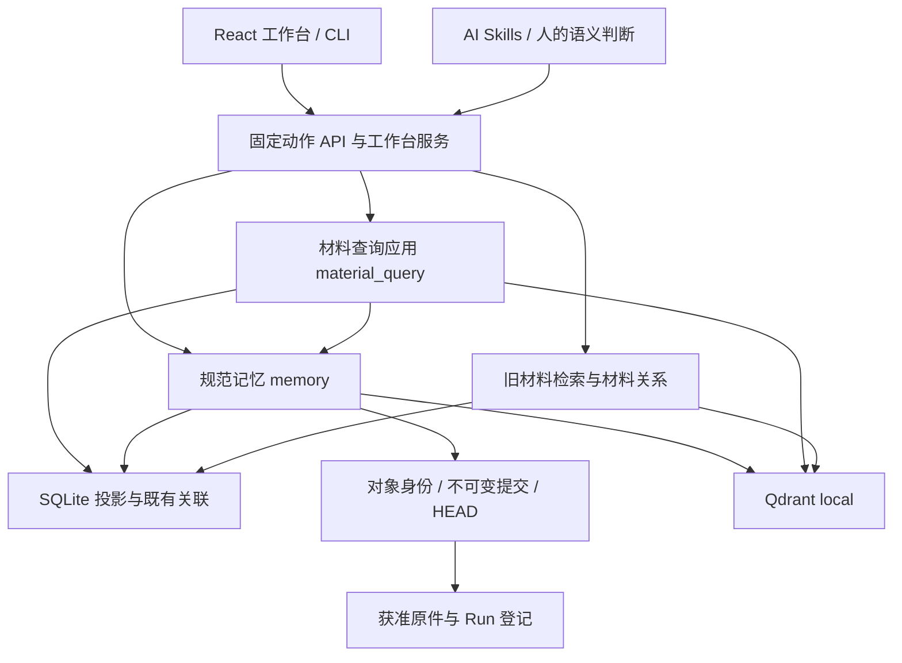

# 当前技术架构

本页维护实际模块、依赖和状态所有权；用户概念与用法见 [README](README.md)，功能输入输出见 [CORE](docs/CORE.md)，细节见[文档索引](docs/README.md)。核对日期：2026-09-13；当前采用统一work-loop与按内容保存策略，阅读会话增加Owner绑定和工作台入口，兼容既有材料查询 v0.2 与固定来源读取。历史设计不替代运行代码；具体程序指纹见对应实施 Run。

## 稳定设计约束

本节用于约束后续设计，实际依赖和未完成项见下文；原则保留下来不表示代码已完全达到目标。根规则的三项评价标准见 [AGENTS](AGENTS.md)。

| 设计时必须守住的边界 | 对开发方案的要求 |
|---|---|
| 按变化原因划分模块 | 规范存储、检索和 AI 行为控制分别演进；核心定义稳定接口，外围实现接口。不为消除表面重复提前绑定不同概念，也不凭接口名称宣称后端可替换 |
| 状态少、集中、显式 | 每类状态有唯一权威来源和明确转换；保存、索引、复核、关联采纳分别表达。新增状态先说明维护者、生命周期、失败恢复及消费者，不能让 UI 或缓存成为第二份业务真源 |
| 性能收益须有依据 | 新抽象、缓存或图机制须解决已存在或高度确定的问题；用可重复评估比较准确度、召回、错误关联、延迟与上下文成本。输出 Top-K 或短正文不能证明底层读取有界 |
| 对象、内容、文稿分开 | 复用 Research、Run、Project、核心算法、数据、工具、知识和报告的稳定身份，不复制等价 Owner；Project 聚合目标和引用，不另存算法副本。L0 是原件追溯，L1 检索说明与完整块分开，层级不是可信等级，独立章节/文稿不另造记忆层 |
| 权威记录与派生数据分开 | 原件、规范修订和复核记录不能被索引替代。索引可重建；Q/CTX/CF、QMEM/PKT 等已保存回执是查询与选择的历史，不能当作临时索引随意清理；MQ 进程内请求状态另有到期规则 |
| 写入和恢复保持单一边界 | 规范写入走 MEM 服务，保留版本冲突、幂等、不可变历史和单 Owner 事务边界；索引失败补偿投影，不重复创建业务记录，不把跨对象部分完成写成全局成功 |
| 语义判断与程序执行分开 | AI/人负责综合、反证、迁移判断和实际审查；程序校验、固定读取、组装及提交。影响提示和监测只产生关注/候选，不自动改章节引用、撤回结论或晋升复核；相似和导航采纳不等于科学支持 |
| 请求边界贯穿全链路 | 查询、续页、展开与组包保留用途、范围、排除、权限、固定版本与累计预算；来源选择不放宽上限。候选不是已读正文，组包无缺口不代表研究完整 |

修改方案先定位下方模块影响表中的责任模块，再追踪实际调用者和数据消费者；涉及新职责、状态或依赖时，先补清归属、关系与变化原因，再决定是否自动化。契约变化同步检查生成类型、CLI/HTTP/UI、Skill、相关测试及升级兼容；只检查实际受影响路径，不机械全库重测。当前定义与实现差距必须保留，不能借整理文档掩盖它。

## 技术栈与运行入口

Windows x64 本地应用：`workbench.cmd` / `workspace_cli.py` 启动 Python CLI 或本机 HTTP 服务；工作台使用 React/TypeScript，构建后的 JS/CSS/Worker 随源码交付。使用端无需 Node，开发依赖由前端锁文件管理。

原始业务卡使用 JSON/Markdown；规范记忆使用对象内不可变文件提交。SQLite FTS 和 Qdrant local 提供可重建检索投影；本地嵌入/OCR 由匹配的离线依赖包提供。材料查询支持身份、词法与显式启用的本地向量通道；通道实现存在与本机模型/索引就绪分别表达，缺失时保留其他通道并报告降级。

图表示主要调用/读取关系，不表示每次请求都会经过全部节点。权限、证据核验和计量横跨相关路径；AI 不直接写规范存储文件。

## 模块与变化影响

代码路径除显式 `automation/` 外均相对 `automation/scripts/`；同一单元格中省略目录的文件沿用前一文件的目录。下表是全局模块影响的唯一现行入口；Project 只保存本次处置与历史快照。

| 模块 | 实际职责与代码入口 | 变化时检查的关联 |
|---|---|---|
| OBJ 对象与来源 | `manifest_discovery.py`、`run_capture.py`、`memory/owners.py`、`raw_materials.py`（后者在 memory 内）：稳定身份、唯一 Run 归属、L0 追溯 | MEM 身份/兼容、EVD 授权、RET 索引、MQ 原件回读、APP 树、QA 升级保护 |
| MEM 规范版本 | `memory/contracts.py`、`service.py`、`store.py`、`recovery.py`：验证、CAS、幂等和恢复；schema 在 `automation/schemas/` | DOC/EVD/RET/MQ 的全部读取者、生成类型与旧版迁移 |
| DOC 技术内容 | `memory/technical_units.py`、`documents.py`、`history.py`、`research.py`：完整块、可选章节/文稿与续接 | MEM 字段、RET 表示、MQ 组包/定位、EVD 影响检查、APP 与研究 Skill |
| EVD 来源与证据 | `evidence.py`、`memory/evidence_adapter.py`、`impact.py`、`lineage.py`：复核、权限和已登记依赖影响 | 所有正文返回、正式筛选、文稿、关联、监测与导出 |
| RET 投影与基础检索 | `retrieval.py`、`context_engine.py`、`qdrant_backend.py`、`memory/index.py`、`search.py`、`packets.py`、`associations.py` | MQ 召回/覆盖、旧 API、来源撤权、模型隔离、相关性和读取成本 |
| MQ 材料查询应用 | `material_query/`：Coordinator 编排；`recall.py` 适配既有本地向量并核对条目指纹；Reader/Writer 适配；`content.py` 固定关联展开，`catalog_search.py` 全来源召回，`history_search.py` 有界旧修订查询，`documents.py` 文稿去重与有序组装，`native_sources.py` 核验旧 Run claim；StateStore/Ledger 管请求状态和累计预算；Foundation 接旧功能分组 | MEM 事务、RET 水位、DOC 固定块、EVD 准入、APP 生成契约与三个专项 Skill |
| APP 产品入口 | `workspace_cli.py`、`memory/api.py`、`material_query/api.py`、`workbench_app/`、`automation/frontend/src/` | 同一动作的 CLI/HTTP/UI 请求与错误、任务进度、契约、构建资源、操作文档 |
| GUIDE 规则与说明 | `automation/workflows/` 方法源、`.agents/skills/` 发现入口及六份必读文档 | 所描述能力的代码/契约、用户入口、测试选择；不复制一套业务状态 |
| READ AI 阅读工作流 | `material_query/reading.py`、`reading_catalog.py`：持久问题会话与有界目录发现、分层查询、交付与笔记、下一步控制；复用 MQ Reader/Assembler/Ledger，AI 判断由 material-query Skill 指导 | MQ 权限/预算与固定回源、CLI/HTTP及ReadingSessions界面、原件新修订、GUIDE 续接策略、QA 用户工作数据升级保留；不增加规范记忆类型或向量后端 |
| QA 测试与交付 | `automation/testing/`、`automation/tests/`、`deployment.py` 及依赖分发 | catalog 与实际回执、前端指纹、旧业务/自定义 Skill 保留、离线包与恢复 |

表中一行变化时检查其实际调用者、数据消费者和对应细节文档；不是要求每次全模块重测。文档路由与维护方式见 [DOCUMENTATION_MAINTENANCE](docs/DOCUMENTATION_MAINTENANCE.md)。

## 状态由谁负责

| 状态 | 权威来源 | 独立边界 |
|---|---|---|
| 对象、Run、来源授权 | 原生 manifest、`run.json`、`retrieval/sources.json` 及获准原件 | 文件存在不等于登记；登记不保证固定原件仍可读 |
| 规范内容与历史 | Owner 的 `memory_home` 中 owner/commits/HEAD 与事务回执，MemoryStore 管理 | 单 Owner 提交可见；旧修订不改写，没有跨 Owner 全局事务 |
| 保存与索引 | 保存回执；SQLite `memory_*` 表及 FTS/向量水位 | HEAD 发布后索引失败仍是已保存，reconcile 补偿，不重建同一业务记录 |
| 查询候选、选择与预算 | MQ 进程内 QueryState、StateStore、Ledger | 默认 900 秒 TTL；游标绑定原请求/会话，重启或到期失效；不是持久知识 |
| 当前任务工作上下文 | 所属任务的一份Markdown计划/清单，由AI编辑 | 综合目标、当前依据、必要细节与下一步；RS与Run通过引用接入。不是后台同步、规范知识或第二份阅读数据库；检查点保存交接时点，续接需核验新进展 |
| 当前问题阅读工作 | `.local/reading-sessions/` 的 HEAD、revision历史与请求/消费记录；Reading 管理 | 独立 RS 身份、单会话锁和版本比较；跨进程累计预算及授权复核，不复活 MQ 游标、不替代规范知识。此目录是用户工作数据，不能按缓存删除 |
| 查询术语与冻结计划 | `retrieval/query-terms.json` 是用户维护词库；`material_query/query_plan.py`加载校验并构造本轮计划，RS保存该轮指纹及实际展开 | 公共种子单独位于`automation/templates/query-terms.default.json`，仅补缺；续页使用冻结计划，词库修改不回写已发生查询。同义与关联分开，不新增规范知识/模型/后台翻译服务 |
| 语义维护计划 | `.local/material-query/plans/` 不可覆盖计划版本 | 与规范提交分开；重启后用新查询重新授权旧计划，可能逐 Owner 部分完成 |
| 复核与关联采纳 | 原生/记忆 claim、review；association 的采纳状态 | 保存、索引、复核和导航采纳不能合成“成功” |
| 视图和观察 | `.local/workbench/` 视图/候选、`context/monitor/` 观察记录 | 不改规范证据；工作台后台任务状态不代替实际扫描/索引结果 |
| 历史查询及反馈 | 旧 Q/CTX/CF、记忆 QMEM/PKT 及各自回执 | 各自入口使用自己的身份和预算语义，不可互换 |

新 Run 默认属于开展工作的 Owner；无归属轻任务可落根 runs，旧布局兼容。来源搬迁通过显式旧路径/固定 SHA 映射回读，不重写旧 Run。

## 数据流与当前限制

2026-09-13 AI阅读工作流按L4/L3、L2、L1独立identity/lexical/dense召回，共用持久账本。短候选全文、技术命中块加必要定义；保留后完整交付，再保存AI理解/连接/细节。RS的HEAD是阅读状态唯一真源，显式绑定Owner及可选固定检查点；目录窗口list不建平行索引，view复核来源并返回最新版本。工作台系统记忆可按Owner查看、打开固定原文和导出版本快照。是否补查/询问由AI判断；历史ask_user仍须真实意见，硬范围/预算不变。无后台AI。

2026-09-15阅读召回增加调用者生成的少量中英计划：AI选择语料语言、技术问题英文补查、等义句及领域；query_plan校验保护文本、有界加载词库，同义扩词与单跳关联分别执行。reading按层执行原身份路、各变体词法/dense与低权重关联路，按固定身份融合排名并保存hit/query来源；条件核对仍由AI实际读正文完成。通用QueryRequest及手动工作台查询契约不改；CLI/HTTP阅读入口共用同一执行。新增路数消费原Ledger，旧请求兼容且缺库可见；新旧RS续页各沿其已保存计划语义。修改时检查READ/MQ、Skill、术语模板与升级保护、召回预算及相关性。

规范保存经 schema/领域规则校验，以 expected_head/expected_revision 拒绝覆盖新修改，以 request_id 识别重试；单对象锁内准备不可变提交，再发布 HEAD，之后更新投影。文稿固定跨对象引用并复查依据，是显式版本核验，不是全库数据库快照。

旧 `search-knowledge/retrieve-context` 与 `memory search/context` 并存，共用 SQLite 文件但分表、回执和策略。memory 普通知识检索除说明/知识字段外，为 L1 稳定正文块建立派生条目；候选预览仍用检索说明。材料查询复用这些投影，正文命中绑定记录修订与块定位；规范正文仍只有原记录一份，文稿与 L0 保留各自入口。

词法与向量窗口先按记录去重，再限制候选数量，每记录最多保留四条实际命中诊断；RRF 每通道每规范身份只投一票。向量查询输入由本机模型 tokenizer 计量，最多512 token，计入同一查询的模型调用和输入预算。当前本地向量计算仍扫描获准点，SQL排序与身份元数据也可能随索引增大；有界返回不是固定计算成本。推理无法在单次调用中强制中断，完成后立即核对取消/时间预算。

投影和编码版本分别升级到 technical-blocks v4；旧水位即使 HEAD 相同也不算覆盖。重建只更新派生 FTS/向量，不改变规范历史、原件或结论状态；模型文件、384维契约及依赖锁未变。通用 Foundation 模型策略仍未注册，内置 dense 不代表任意模型接口已开放。

MQ 的直接候选范围与必要依据读取上限分别校验。APP 默认把获准全局范围作为依赖上限，保留所有排除；用户可收紧为所选范围。来源、类型和分层只筛直接候选，不能误拦父材料已声明的必要依据。默认 current 查询及缓存回读重新核验当前修订；显式 allow_stale 查询增加有界旧版本扫描，fixed 只保持既定引用读取。维护提交后的历史状态审计按固定依据回读，重新应用仍核验当前 HEAD。文稿在同一查询账本内按固定文稿身份去重，保留逐块图像编号；图像经过 Reader 的来源授权、哈希与字节预算核验。增加这些功能未引入新的数据库、模型、后台任务或跨查询缓存。

依赖尚未完全倒置：MemoryService 与具体索引有互调，Reader/MeteredStore 复用既有存储，Foundation 是受限适配层。不能由接口名字推断后端可以任意替换；部分枚举、来源闭包和历史查询仍可能扫描较大范围，最终 Top-K 不等于固定底层成本。

默认 memory context、评估用完整图扩展、材料图展示和 MQ 的有界加深分别存在。当前 MQ 没有注册生成式模型/分词提供器或自动维护代理；实际 AI/人的语义工作由 Skill 和公开入口完成。主入口以 content_source 在 LIMIT 前限定内容种类，读取已有完整正文；expand 在原 QueryState/Ledger 内按固定关联展开。来源模式不修改 scope_ceiling。新 narrative/overview 及分类 experience 由 v4 schema 管理。层级迁移仍由 MEM 单一写入服务执行：只允许 event→narrative、map→overview 的显式完整修订，并固定引用前版；当前身份唯一、旧修订不可变。APP 只提供统一层级入口；MQ、EVD、续接和来源沿袭都读取迁移后的规范类型。旧表示查询继续兼容。

安装/升级统一 `setup.cmd`，前端资源及指纹配套交付；依赖与模型离线核验后切换，旧环境保留可恢复回执。标准模型迁移仍限约定名称/路径和兼容 384 维。软件、检索质量、性能、实际 AI、人工及第二物理机验收各自记录；历史质量缺口和万条规模暂缓保持显式。
